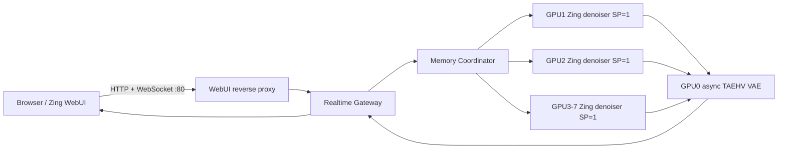

# 阿里云 8 x RTX 4090 Zing 实时推理部署与压测报告

## 1. 结论

- 已在阿里云北京 `cn-beijing-i` 的单台 8 卡 RTX 4090 ECS 上完成 Zing 单模型实时推理链路部署。
- 拓扑为 1 张 4090 运行异步 TAEHV VAE，另外 7 张 4090 各运行 1 个 `SP=1` Zing denoiser。
- WebUI、Gateway、Coordinator、7 个 denoiser、异步 VAE 及心跳进程均已正常运行。
- 真实浏览器已完成 I2V、连续视频播放、W 键控制和 45 秒会话自动释放验证。
- 480p 稳态压测下，7 个并发 Session 全部成功，错误率为 0，总输出约 `93.23 fps`，单 Session 最低约 `13.73 fps`。
- 第 8 个 Session 可通过 Coordinator 有界等待后成功执行，但同时占用 GPU 的活跃 Session 上限仍为 7。
- 压测完成后 Coordinator 显示 `denoiser free_slots=7`、`vae free_slots=16`，没有残留 Session。

## 2. 部署版本与资源

| 项目 | 实际值 |
| --- | --- |
| Git 基线 | `origin/main@54bdfea9cd52ac1cd79896e1a7275e18a0257b79` |
| 工作分支 | `codex/aliyun-4090-zing-deploy-20260817` |
| 地域 / 可用区 | 北京 / `cn-beijing-i` |
| ECS | `i-2zegvp51qv6iuyesw65m` / `ecs.ebmgn8te.32xlarge` |
| 计算资源 | 128 vCPU、1 TiB RAM、8 x NVIDIA GeForce RTX 4090 46 GB |
| 计费方式 | 按量付费，`PostPaid`、`NoSpot` |
| 公网带宽 | 100 Mbps |
| 数据盘 | 200 GB ESSD PL0，挂载到 `/data`，Docker 与模型缓存复用该盘 |
| 公网地址 | `http://8.147.109.68/` |

模型制品保存在北京 OSS，并下载到 ECS 的 `/data/zing-realtime/model-cache/zing/model`。运行镜像来自北京 ACR；代码以当前分支 overlay 的方式注入容器，避免每次重建大型 GPU 基础镜像。

## 3. 运行拓扑

关键配置：

- Zing：`MinWMCausalDMDPipeline`、`SP=1`、`TP=1`、CUDA Graph 开启、`torch_sdpa` attention。
- 每个 denoiser 最大 1 个活跃 Session，共 7 个活跃 Session。
- VAE：TAEHV `taew2_2.pth`、GPU0、`bfloat16`、单帧批次、最大 16 个 Session。
- 消费级 GPU 参数：`--vae-config.taehv-checkpoint-path=/opt/taehv/taew2_2.pth`、`--vae-cpu-offload=true`。
- 默认请求：`832x480`、24 fps、9 帧、4 steps、sink 8、window 32。
- 会话最长 45 秒；WebUI 只展示单路居中的 Zing 视频。

## 4. 端到端验证

| 检查项 | 结果 |
| --- | --- |
| WebUI 首页及运行时配置 | HTTP 200 |
| 页面模型 | 仅显示 Zing，无 LingBot 对比播放器 |
| 默认尺寸 | `832x480` |
| I2V 初始化 | 成功 |
| 连续 WebSocket 视频 | 成功，浏览器可持续解码和渲染 |
| W 键动作 | 成功发送，视频链路继续输出 |
| 自动释放 | 45 秒后断开，Coordinator 容量恢复 |
| 容器健康 | 19 个相关容器全部运行 |
| 错误日志 | 未发现 OOM、Traceback 或容量泄漏 |

浏览器实测稳定阶段可见约 24 source/receive fps。页面中的 `action -> first frame` 与下面压测的指标含义不同：浏览器数据还包含播放缓冲和渲染，压测数据截止到客户端收到对应 chunk 的首帧。

## 5. 压测方法

- 工具：`benchmark/minwm_realtime_async_vae/load_test.py`
- 请求：I2V、`832x480`、24 fps、9 帧、4 steps、sink 8、window 32。
- 稳态测试：每个 Session 预热 2 个 chunk，统计后续 8 个 chunk。
- 短突发测试：每个 Session 预热 1 个 chunk，统计后续 4 个 chunk。
- `chunk` 耗时为客户端观察到完整 chunk 返回的时间。
- `action -> first frame` 为客户端发出带 action 的请求，到收到对应输出首帧的时间，不包括浏览器 canvas 真正显示的时间。

## 6. 稳态压测结果

| 并发 Session | 成功 / 失败 | 总吞吐 fps | 单 Session 平均 fps | 单 Session 最低 fps | Chunk 平均 / P95 | Action 到首帧平均 / P95 |
| ---: | ---: | ---: | ---: | ---: | ---: | ---: |
| 1 | 1 / 0 | 14.42 | 14.42 | 14.42 | 1109.83 / 1684.59 ms | 1252.74 / 1681.99 ms |
| 2 | 2 / 0 | 29.19 | 14.72 | 14.65 | 1086.92 / 1672.56 ms | 1151.36 / 1695.98 ms |
| 4 | 4 / 0 | 67.95 | 18.28 | 17.41 | 877.23 / 1547.12 ms | 2027.16 / 2879.93 ms |
| 7 | 7 / 0 | 93.23 | 14.32 | 13.73 | 1117.95 / 1753.30 ms | 1826.04 / 3507.24 ms |

并发 4 的单 Session fps 高于并发 1/2，说明实时输出具有明显的 chunk burst 和采样窗口效应，不能据此推导单请求获得了超线性加速。容量判断应以 7 并发全部成功、错误率 0、Coordinator 无泄漏为主。

## 7. 短突发与排队验证

短突发 7 并发的总吞吐为 `115.10 fps`，单 Session 最低为 `17.80 fps`，Chunk P95 为 `978.11 ms`。该结果受短采样窗口影响，作为热态上限参考，不作为稳态容量承诺。

额外发起 8 并发时，8 个 Session 均成功且错误率为 0。因为 denoiser 只有 7 个活跃槽，第 8 个 Session 通过 Coordinator 等待前一个槽释放后执行；因此当前系统的定义是：

- 最大同时运行并发：7。
- 短时可接受并发：至少 8，但超出 7 的请求会排队，延迟不能保证。

## 8. GPU 观察

150 秒采样窗口覆盖了空闲、测试和测试后阶段，因此平均利用率不代表压测区间的持续利用率。可用于判断瓶颈的峰值如下：

| GPU | 角色 | 显存峰值 | GPU 利用率峰值 | 功耗峰值 |
| ---: | --- | ---: | ---: | ---: |
| 0 | 异步 TAEHV VAE | 734 MiB | 35% | 79.1 W |
| 1-7 | Zing denoiser | 约 34.0 GiB / 卡 | 100% | 约 418-446 W / 卡 |

VAE GPU 在 480p、7 并发下仍有明显余量；本轮瓶颈主要位于 denoiser，而不是异步 TAEHV decode。单独占用整张 4090 跑 VAE 对当前 480p 流量偏宽裕，但符合本次要求，并为后续分辨率或并发增长预留空间。

## 9. 限制与后续建议

- 本次没有在同一台 4090 机器上重跑同步 VAE 基线，所以不能严谨给出“异步 VAE 相比同步 VAE 提升百分比”。
- 稳态 7 并发下 Action 到首帧 P95 为 3.51 秒；若目标是交互延迟而非吞吐，需要继续拆分 denoise、VAE、Gateway send 和浏览器 render 埋点。
- 当前 Coordinator 使用内存后端，适合单 ECS 验证；扩成多节点时应替换为共享协调存储，并增加故障转移测试。
- ECS 是按量非 Spot 实例，服务保持运行期间会持续计费；200 GB ESSD 数据盘设置为不随实例删除。

## 10. 代码验证

- WebUI JavaScript：18 个 Node 测试全部通过。
- 新增容器父进程信号保护：远端单元测试 1/1 通过。
- `node --check`、Python `py_compile`、Shell `bash -n` 和 `git diff --check` 全部通过。
- `test_realtime_webui.py` 当前有 5 个断言失败、3 个通过；逐项比对 `origin/main` 后确认失败断言依赖的旧模块导入路径、DOM id、CSS cache tag 和旧源码字符串在本次分支基线中已经不存在，属于主分支陈旧测试，不是本次 Aliyun 单模型改造引入的回归。

## 11. 原始结果

- `results/smoke-c1.json`
- `results/load-c1-2-4-7.json`
- `results/load-steady-c7-4-2-1.json`
- `results/load-overload-c8.json`
