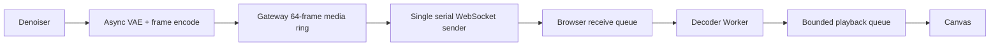

# Realtime Gateway 播放反压改造

## 问题与结论

Zing/LingBot2 的 VAE 会以批次快速输出视频帧，而公网浏览器的 WebSocket
`send_bytes` 可能短暂阻塞。旧 Gateway 只有 8 个消息槽；每个消息入队最多等待
50ms 后才淘汰旧数据。一次 16 帧输出在队列满时会额外产生约 `16 * 50ms =
800ms` 的人工尾延迟，并把浏览器网络反压传回 VAE 链路。

当前前端已使用独立 Decoder Worker、解码队列和播放队列，单帧解码耗时通常低于
一帧预算，因此本轮不增加浏览器并发解码。优先消除 Gateway 热路径的串行等待。

## 目标链路

## 队列语义

1. `queue_depth` 表示真实媒体帧容量，不再表示 MessagePack 消息数量。
2. 默认容量为 64 帧。按当前 720p WebP 实测帧大小，单会话通常占用约
   2-6MiB，可吸收约 2.7 秒的 24 FPS 抖动。
3. 媒体入队不等待；容量不足时立即按批次淘汰最老媒体帧，再写入最新媒体。
4. `media_chunk_complete` 不计入媒体帧容量，也不会被媒体淘汰。它必须被保留，
   以便 VAE 释放 chunk credit，并保持 drain/close 语义完整。
5. 浏览器发送仍由一个串行协程完成，避免多个协程并发写同一 WebSocket 造成乱序。
6. 控制消息体积很小，且 WebUI 会话有最大生命周期；媒体内存始终由 64 帧上限约束。

## 可观测性

`gateway.output_enqueued` 与 `gateway.browser_send_complete` Trace 记录：

- `enqueue_ms`
- `gateway_queue_depth`
- `gateway_queue_messages`
- `gateway_queue_bytes`
- `gateway_oldest_frame_age_ms`
- `gateway_dropped_frames`
- `gateway_dropped_messages`
- `browser_send_ms`

这些字段可以区分 VAE 生产慢、Gateway 排队、浏览器网络发送慢和浏览器播放慢。

## 验收标准

- 无消费端时连续入队的 P99 小于 5ms。
- 媒体队列不超过 64 帧；满载时丢弃最老媒体而不是阻塞 VAE。
- chunk 完成标记不丢失，`join()` 能正常结束。
- 浏览器发送阻塞时不会因媒体队列满主动关闭模型会话。
- 前端现有双模型、Decoder Worker、平滑播放和事件控制回归测试全部通过。

## 发布与回滚

只更新 `minwm-realtime-gateway` 和 `minwm-showcase-gateway` 两个 CPU Deployment；
不更新 GPU Worker。回滚时把两个 Deployment 镜像恢复为上一个 Gateway digest，并把
参数恢复为旧值即可。新旧版本不改变 WebSocket 协议。
